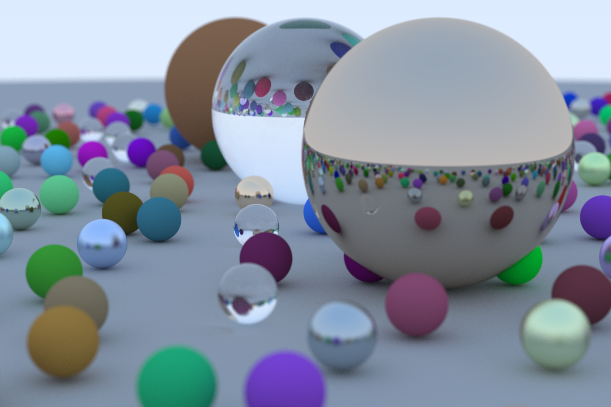

# Rust Raytracing

This is an implementation of the raytracer described in the book [Ray Tracing In One Weekend](https://raytracing.github.io/books/RayTracingInOneWeekend.html) written in Rust.

# Results

